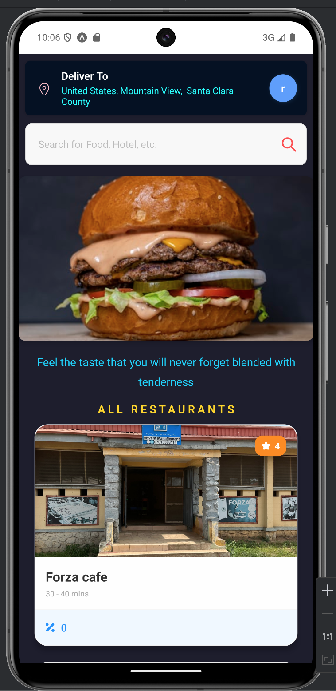
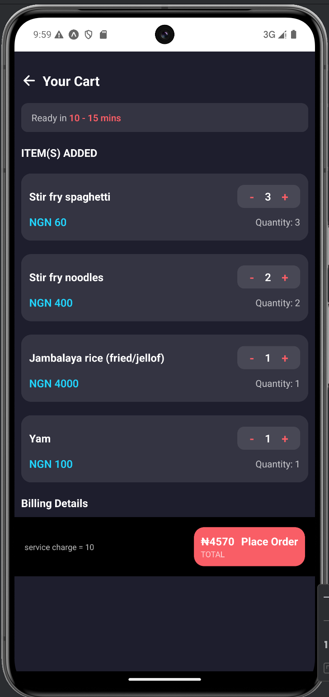
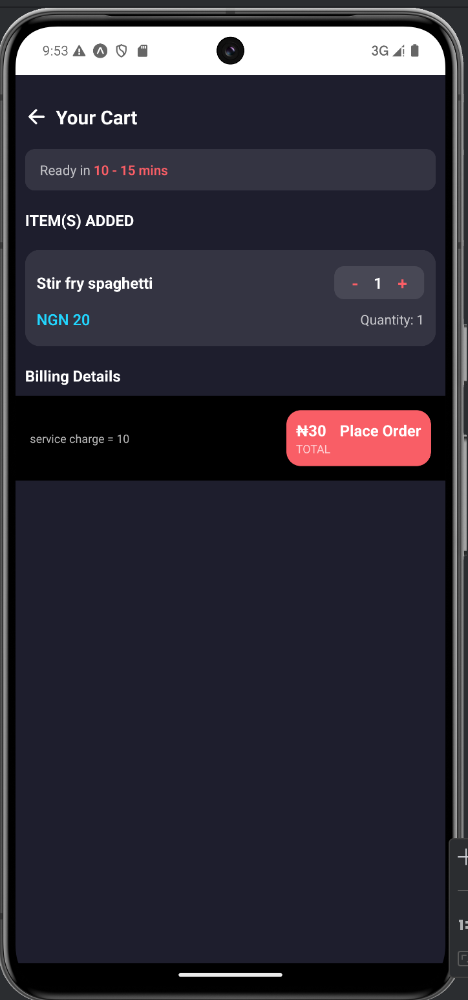
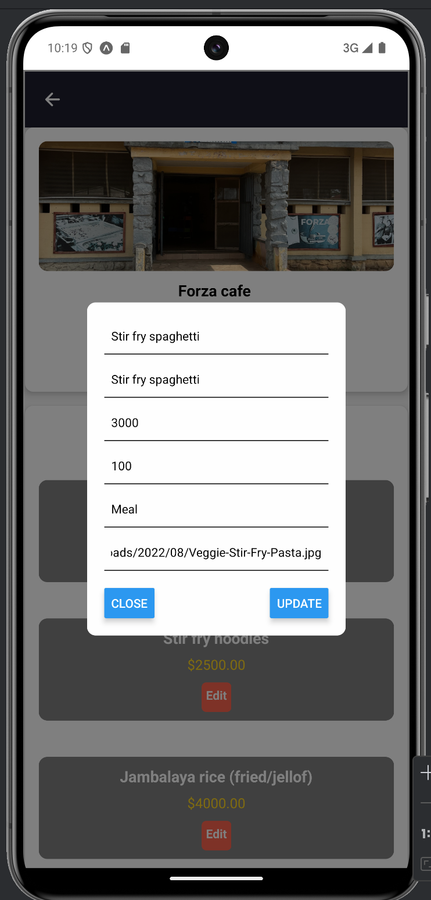
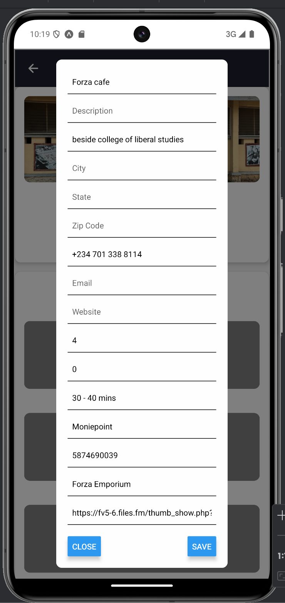

# Food Hub - README

## Overview

Food Hub is a mobile application built with React Native (Expo) and Express.js. It connects customers with restaurants, allowing them to browse menus, add items to their cart, and place orders. The app supports two delivery methods: online delivery and on-site pickup. Restaurants can manage their menus and account details via an admin page.

## Features

### Customer Features

- Browse a list of restaurants.
- View restaurant menus and select items.
- Add items to the cart and place orders.
- Choose between online delivery or on-site pickup.
- Secure authentication with login and registration.

### Restaurant Admin Features

- Modify restaurant profile and account details.
- Add, update, or remove menu items.
- Manage incoming orders.

## Authentication

- Login and Register pages for both customers and restaurants.

## Tech Stack

- **Frontend:** React Native (Expo)
- **Backend:** Express.js
- **Database:** PostgreSQL / MySQL

## Database Schema

| Table            | Description                                 |
| ---------------- | ------------------------------------------- |
| `restaurant`     | Stores restaurant details and account info. |
| `user`           | Stores customer details.                    |
| `order`          | Stores order details and statuses.          |
| `product`        | Stores menu items for restaurants.          |
| `transaction`    | Logs payment transactions.                  |
| `payment_method` | Stores available payment methods.           |

## Installation & Setup

### Backend (Express.js)

```bash
git clone [https://github.com/yourusername/food-hub.git](https://github.com/yourusername/food-hub.git)
cd food-hub/backend

npm install

npm start
```

### Frontend(React Native)

```bash
   #start frontend

   cd ../frontend

   npm install

   expo start
```

## Screenshots

1.  Authentication

## Login


## Register


## Logout


## Login Successful


2.  Customer Pages

## Customer Landing Page



## Restaurant Menu Page


## Add To Cart Page


## Order Page



## Order By Delivery Page



## Order By Online Page


## Online Payment Page


3. Restaurant Admin Pages

## Restaurant Logout Page


## Restaurant Admin Page


## Update Product Page



## Update Restaurant Page


